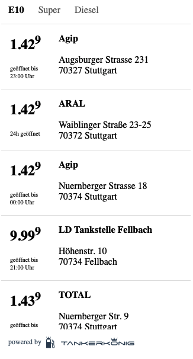
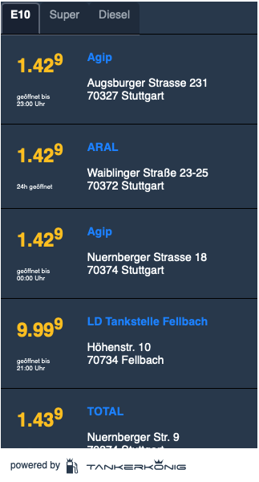

# tankerkoenig-web-component

[link text itself]: http://www.reddit.com

## Purpose
build a self contained custom web component for modern browsers (no IE or Edge) using the [tankerkönig API](https://creativecommons.tankerkoenig.de/swagger/)

This "widget"-like component is stylable with css variables from outside the component.

     

## Inspiration

using vue cli > 3

initial project setup was done following along this great [post](https://medium.com/@royprins/get-started-with-vue-web-components-593b3d5b3200) on medium

## first things to do
* get yourself an API key from here [https://creativecommons.tankerkoenig.de](https://creativecommons.tankerkoenig.de)

## Project setup
```
npm install
```

### Compiles and hot-reloads for development
```
npm run serve
```

### Compiles and minifies for production
```
npm run build
```


### Lints and fixes files
```
npm run lint
```

### Customize configuration
See [Configuration Reference](https://cli.vuejs.org/config/).


## Styling
inside the component css variables are used with default values as fallback
```html
<style>
    wrapper {
        font-family: var(--font-family, 'Open Sans,Arial,Helvetica,sans-serif');
        font-size: var(--font-size, 14px);
        color: var(--font-color, black);
        background: var(--bg-color, white);
        ...
    }
</style>

```
users of the component can overwrite the styles on their page with a style tag in the head section of their page

#### available css-vars

```html
--bg-color          //widget background color - default #fff
--font-color        //main font color - default #000
--font-family       //font family -default 'Open Sans,Arial,Helvetica,sans-serif'
--station-padding   //padding used by a station item - default 15px
--font-size         //main fint size - default 16px
--tab-color         //color of tab background - default #fff
--tab-border-color  //tab surrounding border - default #fff
--time-fontsize     //font size for opening times - default 10px
--brand-color       //fuel bran color - default #000
--price-color       //price color - default #000
--price-fontsize    //price font size - default 24px
--divider           //station divider - default '1px solid #e2e2e2'
```


#### example

```html
<style>
    tankerkoenig-web-component {
        --font-family: "Arial";
        --font-size: 16px;
        --price-fontsize: 32px;
        --price-color: #304156;
        --time-fontsize: 12px;
        --font-color: rgba(0, 0, 0, 0.99);
        --bg-color: #ffc828;
        --tab-color: rgba(183, 142, 17, 0.98);
        --station-padding: 20px;
        --divider: 5px solid #dbdbdb
    }
</style>
```

#### or something like this 
```html
<style>
    tankerkoenig-web-component {
        --font-family: "Comic Sans MS";
        --font-size: 24px;
        --font-color: #e9e9eb;
        --brand-color: white;
        --price-color: #08ff06;
        --price-fontsize: 60px;
        --bg-color: #34495D;
        --tab-color: #203444;
        --station-padding: 20px;
        --time-fontsize: 16px;
    }
</style>
```

#### or this 
```html
<style>
    tankerkoenig-web-component {
        --font-family: "Helvetica";
        --font-size: 14px;
        --price-fontsize: 24px;
        --price-color: #ffc828;
        --time-fontsize: 8px;
        --font-color: white;
        --brand-color: #2096ff;
        --bg-color: #34495D;
        --tab-color: rgba(48, 65, 86, 0.98);
        --station-padding: 20px;
        --divider: 1px solid #000000
    }
</style>
```
#### hipster style 
```html
<style>
    tankerkoenig-web-component {
        --font-family: "Courier";
        --brand-color: #8bafa1;
        --font-size: 14px;
        --font-color: #837970;
        --bg-color: #e8e7d4;
        --divider: 1px solid #cdc9b2;
        --station-padding: 25px;
    }
</style>

```
#### some 'mongelesbraun'

```html
<style>
    tankerkoenig-web-component {
        --tab-color: #584848;
        --brand-color: #f4b557;
        --font-size: 18px;
        --font-color: #d8d9de;
        --price-color: #6e7888;
        --price-fontsize: 50px;
        --bg-color: #393b44;
        --divider: 1px solid #584848;
        --station-padding: 25px;
        --time-fontsize: 14px;
    }
</style>
```


## How to use this component


#### add vuejs from the cdn and the component itself in the head section of your page
```html
<script src="https://unpkg.com/vue"></script>
<script src="./tankerkoenig-web-component.min.js"></script>
```

#### place the tankerkoenig-web-component inside a div with ``id="tkwidget"``

```html
<div id="tkwidget" class="widgetOuterDiv">
    <tankerkoenig-web-component apikey="your-api-key" plz="xxxxx"></tankerkoenig-web-component>
</div>
```
#### add your preferred width and height to this surrounding
```html
.widgetOuterDiv {
      height: 600px;
      width: 320px;
    }
```
the component inherits the dimensions from this surrounding div

#### set the web component properties
```html
<tankerkoenig-web-component
    apikey="00000000-0000-0000-0000-000000000002"
    stations="83d5ac80-4f23-4106-b054-7c7704bfcb95,944d2525-4cb4-4a53-9cbe-d80f6a9bbd3a,8eb4ceb1-abbe-4ac1-b23a-77b890fa1d89,508b5f83-1d68-4695-9e4c-5bfeac7e13a9"
    plz="88400"
    lat="48.8"
    lng="9.24"
    rad="2"></tankerkoenig-web-component>
```

* apikey [required]
* stations [array of station ids] or
* plz "german postleitzahl" or
* lng, lat, rad 

The apikey property is always required! 
 
You can either add 
* an array with station ids, 
* or add your postalcode 
* or use longitude, latitude and radius


to configure the stations search. If you provide all of them - stations prop wins over plz wins over lat,lng,rad.